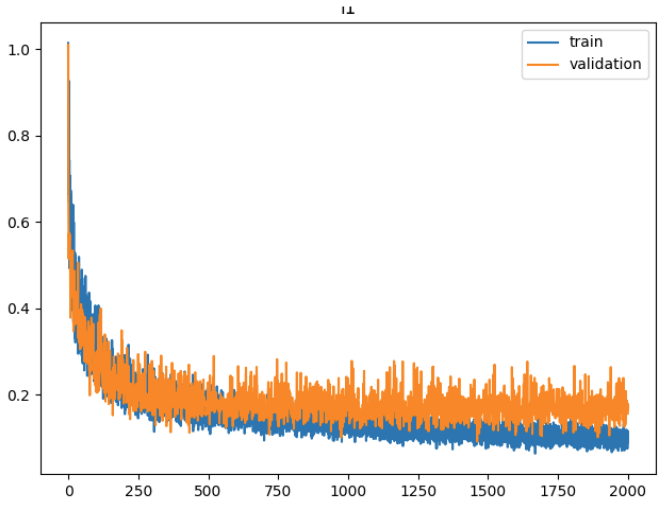

# Collect data
```
python collect_data.py --task_name open_cup --max_timesteps 700 --episode_idx 0
```

* Observation topic: `/puppet/joint_left` and `/puppet/joint_right`
* Action topic: `/master/joint_left` and `/master/joint_right`

```python
data_dict = {
    # puppet states as observation, master states as action
    '/observations/qpos': [],
    '/observations/qvel': [],
    '/observations/effort': [],
    '/action': [],
    '/base_action': [],
    # '/base_action_t265': [],
}
```
* The data is typically stored in the shape of (num_steps, num_dims)
* Typically, 30 time steps correspond 1 sec.

# Visualize data
```
python visualize_episodes.py --task_name pick_little_bear --episode_idx 10
```
* read the data from observation and action topics and plot it

# Replay data
```
python replay_data.py --task_name pick_little_bear --episode_idx 0
```
* read the data from observation (optional) and action topics and plot it


# Training
NOTE: Check task name!!! Otherwise, the previous trained model maybe overwritten.
```
python act/train.py --task_name transfer_cube --batch_size 8 --num_epochs 10 --num_episodes 5 --lr 1e-5
```

# Inference
```
python act/inference.py --task_name transfer_cube_2024_07_10_16_39_49 --temporal_agg --chunk_size 48 --kl_weight 10
```

# Simulation
In the first terminal:
```
roscore
```
In the second terminal:
```
conda activate aloha
python ~/Documents/aloha_sim_ws/src/mobile_aloha_sim/aloha_mujoco/aloha/scripts/aloha_ctrl.py
```
Annotate the initial pose preparation. In the third terminal:
```
python act/inference.py --task_name transfer_cube --temporal_agg
```
In the fourth terminal:
```
python replay_data.py --simulation --frame_rate 30 --task_name transfer_cube --episode_idx 60
```

# ACT Tuning Tips
- Chunk size is the most important param to tune when applying ACT to a new environment. One chunk should correspond to ~1 secs wall-clock robot motion. In our case, the default value of chunk size is 32, which meets this requirement.
- High KL weight (10 or 100), or train **without** CVAE encoder.
- Consider removing temporal_agg and increase query frequency [here](https://github.com/tonyzhaozh/act/blob/main/imitate_episodes.py#L193) to be the same as your chunk size. I.e. each chunk is executed fully.
- train for **very long** (well after things plateaus, see picture)
- Try to increase batch size as much as possible, and increase lr accordingly. E.g. batch size 64 with learning rate 5e-5 versus batch size 8 and learning rate 1e-5
- Have separate backbones for each camera (requires changing the code, see [this commit](https://github.com/tonyzhaozh/act/commit/20fc6e990698534b89a41c2c85f54b7ff4b0c280))
- L1 loss > L2 loss (not precise enough)
- Abs position control > delta/velocity control (harder to recover)
- Try multiple checkpoints

For real-world experiments:
- Train for even longer (5k - 8k steps, especially if multi-camera)
- If inference is too slow -> robot moving slowly: disable temporal_agg and increase query frequency [here](https://github.com/tonyzhaozh/act/blob/main/imitate_episodes.py#L193). We tried as high as 20.

Example loss curve (L1)

